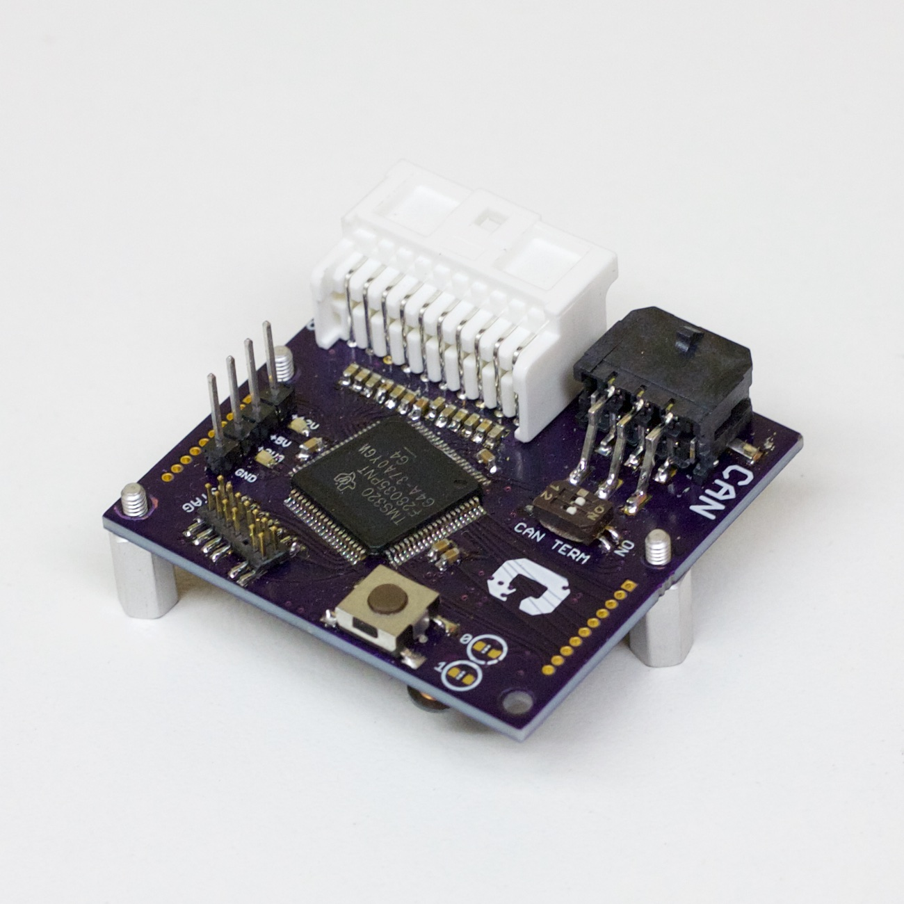

Magic-CAN-Node
==============

Magic CAN Node is a multifunctional, Controller Area Network (CAN)-enabled sensor interface module. It has the ability to connect, measure, and transmit data from a wide variety of sensors.

It's based on the Texas Instruments C2000 Piccolo, a 32-bit microcontroller with useful features. 

Some important features of the Magic CAN Node include:
* 12 analog inputs with buffering and anti-aliasing
* An onboard pushbutton and two general-purpose LEDs
* Access to SPI, I2C, and serial interfaces, as well as power and ADC pins, through standard "backpack" header
* Robust CAN interface, with onboard CAN termination
* Powered from +12V, with a wide 6-42V input range
